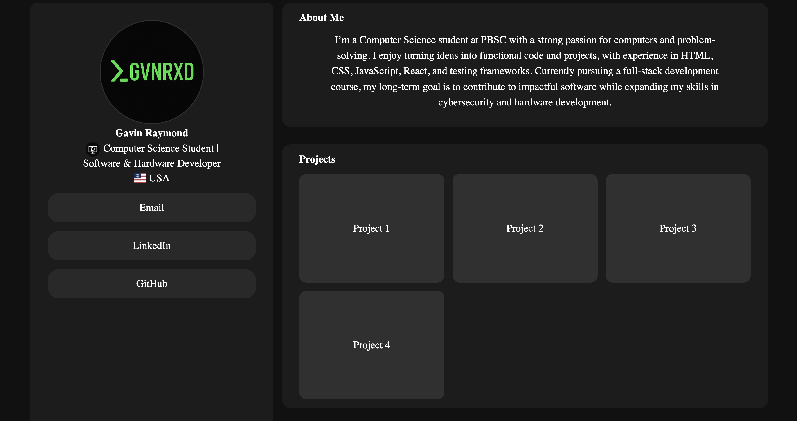

# Gavin’s Portfolio

My personal portfolio site showcasing my projects, skills, and contact information.

## 📸 Preview

## 📸 Preview

<p align="center">
  
</p>

[](https://gvnrxd.github.io/New-Portfolio/)

## 🚀 Tech Stack


![TestBadge]https://img.shields.io/badge/any_text-you_like-blue

## ✨ Features

- Responsive design
- Projects showcase
- Contact section

## 🛠️ Setup

```bash
git clone https://github.com/gvnrxd/New-Portfolio.git
cd new-portfolio
npm install
npm run dev
```


